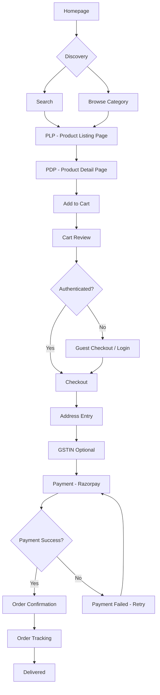

# User Flow 1 — B2C Standard Purchase

## Steps

1. Homepage → Search / Browse Category
2. PLP (Product Listing Page)
3. PDP (Product Detail Page)
4. Add to Cart
5. Cart Review
6. Guest/Login Checkout
7. Address + GSTIN (optional)
8. Payment
9. Order Confirmation
10. Order Tracking
