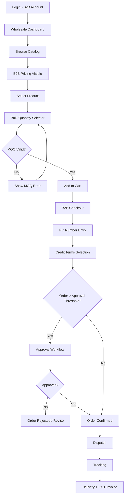

# User Flow 2 — B2B Wholesale Order

## Steps

1. Login (B2B Account)
2. Wholesale Dashboard
3. Browse with B2B Pricing Visible
4. Bulk Quantity Selector
5. MOQ Validation
6. Add to Cart
7. B2B Checkout (PO Number, Credit Terms)
8. Approval Workflow (if order > threshold)
9. Dispatch & Tracking
