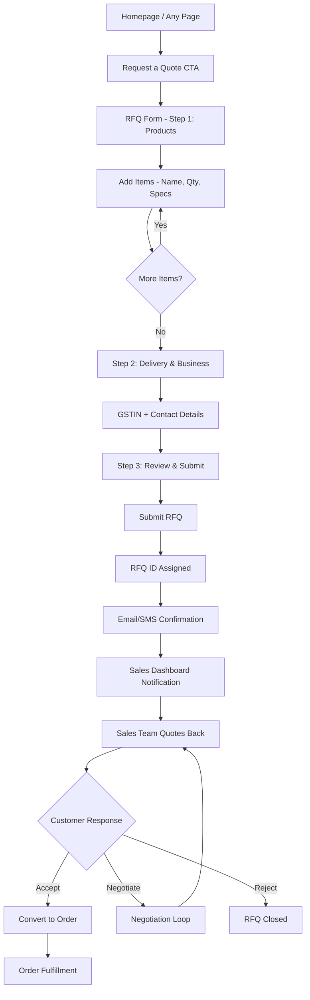

# User Flow 3 — RFQ (Request for Quotation)

## Steps

1. Homepage / Any Page → 'Request a Quote' CTA
2. RFQ Form (Product, Qty, Specs, Delivery Location, Required By Date, GSTIN, Contact)
3. Submission
4. Internal Sales Dashboard Notification
5. Sales Team Quotes Back
6. Customer Accepts / Negotiates
7. Convert to Order
