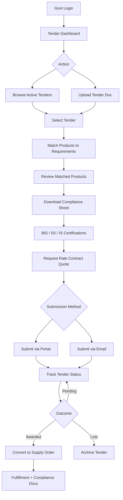

# User Flow 4 — Government Tender Flow

## Steps

1. Govt Login
2. Tender Dashboard
3. Browse Active Tenders / Upload Tender Doc
4. Match Products to Tender Requirements
5. Download Product Compliance Sheet (BIS, ISI, IS Certification)
6. Request Rate Contract Quote
7. Submit via Portal / Email
8. Track Tender Status
