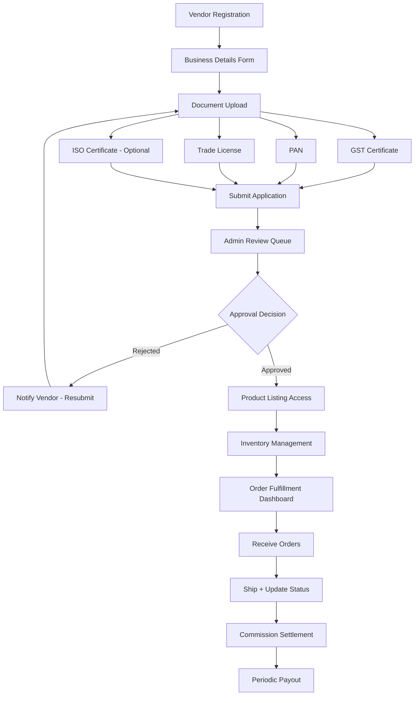

# User Flow 5 — Vendor/Supplier Onboarding

## Steps

1. Vendor Registration
2. Document Upload (GST Cert, PAN, Trade License, ISO if applicable)
3. Admin Approval
4. Product Listing Access
5. Inventory Management
6. Order Fulfillment Dashboard
7. Commission Settlement
